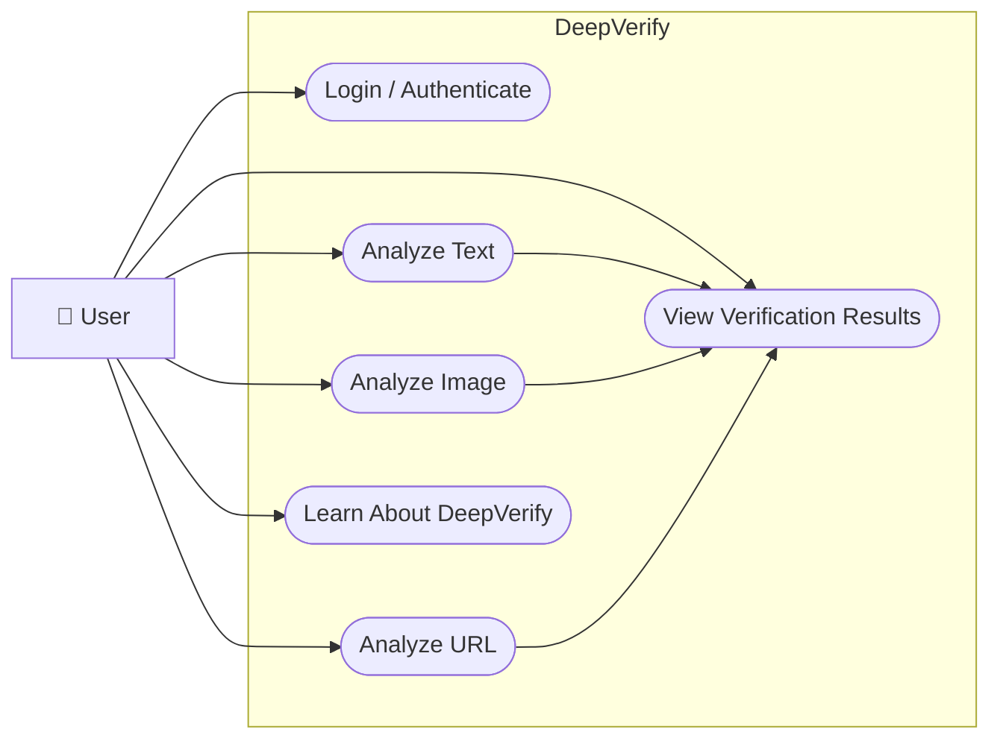

# 🔍 DeepVerify - AI Fake News Detection System

**DeepVerify** is a modern, responsive web application for detecting and verifying potentially fake news using Artificial Intelligence. It provides a secure, user-friendly interface for analyzing **text, images, and URLs** to help users evaluate the authenticity and credibility of online information.

---

## 👤 Use Case Diagram

The use case diagram illustrates how users interact with DeepVerify to authenticate themselves and analyze different types of content.



---

## ✨ Features

### 🔐 Secure Login Gateway

* Protected access with authentication
* Login interface for registered users
* Demo authentication system
* Session management using browser storage

### 📝 Text Analysis

Analyze news articles, social media posts, and other text content to determine their credibility.

* Submit news articles or text
* Analyze textual content
* Receive verification results
* Backend API integration ready

### 🖼️ Image Analysis

Analyze images to identify potential manipulation or authenticity issues.

* Upload images
* Detect potentially manipulated images
* Analyze deepfake-related content
* Verify image authenticity
* Backend API integration ready

### 🔗 URL Analysis

Analyze article URLs and websites to evaluate their credibility.

* Enter article URLs
* Verify website information
* Analyze article sources
* Receive verification results
* Backend API integration ready

### ⚡ Real-Time Results

* Fast processing
* Instant analysis results
* Clear verification feedback
* User-friendly result presentation

### 📱 Responsive Design

DeepVerify works across different screen sizes.

* Desktop
* Tablet
* Mobile
* Responsive navigation
* Mobile-friendly forms

### 🎨 Modern UI

* Clean blue-white theme
* Professional layout
* Gradient-based visual design
* Smooth transitions
* Interactive elements
* Accessible form design

---

## 🏗️ System Flow

```text
┌──────────────────┐
│      User        │
└────────┬─────────┘
         │
         ▼
┌──────────────────┐
│ Login /          │
│ Authentication   │
└────────┬─────────┘
         │
         ▼
┌──────────────────────────────┐
│       DeepVerify Home        │
└──────────────┬───────────────┘
               │
       ┌───────┼────────┐
       │       │        │
       ▼       ▼        ▼
┌──────────┐ ┌──────────┐ ┌──────────┐
│   Text   │ │  Image   │ │   URL    │
│ Analysis │ │ Analysis │ │ Analysis │
└────┬─────┘ └────┬─────┘ └────┬─────┘
     │            │            │
     └────────────┼────────────┘
                  ▼
        ┌──────────────────┐
        │ Verification     │
        │ Results          │
        └──────────────────┘
```

---

## 📁 Project Structure

```text
DeepVerify/
├── index.html              # Login page (entry point)
├── home.html               # Home page with analysis options
├── text-analysis.html      # Text analysis page
├── image-analysis.html    # Image analysis page
├── url-analysis.html      # URL analysis page
├── about.html              # About page
│
├── css/
│   └── styles.css          # Main stylesheet
│
├── js/
│   ├── auth.js             # Authentication management
│   └── navigation.js       # Navigation bar rendering
│
├── assets/                 # Images, logos, and other assets
│
└── README.md               # Project documentation
```

---

## 🚀 Getting Started

### Prerequisites

* A modern web browser
* Python 3 or Node.js for running a local web server
* No frontend framework installation is required

---

## 💻 Local Development

### Option 1: Open Directly

Simply open:

```text
index.html
```

in your web browser.

For best results, use a local web server.

### Option 2: Using Python

If Python 3 is installed:

```bash
python -m http.server 8000
```

Then open:

```text
http://localhost:8000
```

### Option 3: Using Node.js

Using `http-server`:

```bash
npx http-server
```

Then open the URL provided by the server.

---

## 🔑 Demo Credentials

For testing purposes, the application includes demo accounts.

### Admin Account

```text
Username: admin
Password: admin123
```

### User Account

```text
Username: user
Password: user123
```

### Demo Account

```text
Username: demo
Password: demo123
```

> **Note:** These credentials are intended only for demonstration. Production applications should use a secure backend authentication system.

---

## 🔌 Backend Integration

The frontend is prepared for backend integration.

Look for `TODO` comments in the source code where frontend API calls can be connected to a backend service.

### Authentication

File:

```text
js/auth.js
```

The login functionality currently uses demo authentication and can be replaced with a real backend API.

### Text Analysis

File:

```text
text-analysis.html
```

The text analysis page contains a placeholder for connecting to the backend analysis service.

### Image Analysis

File:

```text
image-analysis.html
```

The image analysis page can send uploaded images to a backend AI model.

### URL Analysis

File:

```text
url-analysis.html
```

The URL analysis page can send article URLs to a backend verification service.

---

## 🌐 Expected API Endpoints

### 1. Login

```http
POST /api/auth/login
```

Request:

```json
{
  "username": "user",
  "password": "pass"
}
```

---

### 2. Text Analysis

```http
POST /api/analyze/text
```

Request:

```json
{
  "text": "Article text here"
}
```

---

### 3. Image Analysis

```http
POST /api/analyze/image
```

The request can use `FormData` containing the uploaded image.

```text
image: uploaded-file
```

---

### 4. URL Analysis

```http
POST /api/analyze/url
```

Request:

```json
{
  "url": "https://example.com/article"
}
```

---

## 🎨 Design Features

DeepVerify follows a clean and professional visual design.

### Color Scheme

* Blue and white theme
* Gradient backgrounds
* Clear contrast
* Professional interface

### Typography

The application uses modern, readable fonts such as the **Segoe UI** font family.

### Responsive Design

The interface adapts to:

* Desktop screens
* Tablets
* Mobile devices

### Animations

* Smooth transitions
* Hover effects
* Interactive buttons
* Page interactions

### Accessibility

* Semantic HTML
* Proper form labels
* Clear navigation
* Readable typography
* Responsive layouts

---

## 🔒 Security Notes

The current version is designed primarily as a frontend demonstration.

For production deployment:

* Replace demo authentication with real backend authentication
* Use HTTPS for API communication
* Implement secure session management
* Use CSRF protection
* Validate and sanitize user input
* Store authentication tokens securely
* Prefer `httpOnly` cookies for sensitive authentication tokens
* Implement proper authorization
* Validate uploaded image files
* Restrict file sizes and formats
* Secure all backend API endpoints

---

## 🌐 Browser Compatibility

DeepVerify is designed to work with modern browsers.

* Google Chrome
* Mozilla Firefox
* Microsoft Edge
* Safari

For the best experience, use the latest version of your preferred browser.

---

## 🛠️ Technologies Used

### Frontend

* **HTML5** - Semantic page structure
* **CSS3** - Styling, layouts, animations and responsive design
* **JavaScript ES6+** - Client-side functionality

### Storage

* **LocalStorage** - Demo authentication and session management

### Backend Integration

The frontend is prepared to communicate with REST APIs for:

* Authentication
* Text analysis
* Image analysis
* URL analysis

---

## 📝 Development Notes

### Adding a New Analysis Type

To add another analysis method:

1. Create a new HTML page
2. Add the corresponding navigation link
3. Create the required frontend interface
4. Add a backend API endpoint
5. Connect the frontend to the API
6. Add result handling and error states

### Styling Changes

Modify:

```text
css/styles.css
```

Use the existing CSS variables and styling patterns when adding new components.

### Authentication Updates

Modify:

```text
js/auth.js
```

Replace the current demo login system with the required backend authentication logic.

---

## 🧪 Troubleshooting

### Navigation Not Appearing

Check:

* Whether the user is authenticated
* Whether `js/navigation.js` is loaded
* Browser console for JavaScript errors
* Correct file paths

### Forms Not Submitting

Check:

* Browser console for errors
* Required fields
* JavaScript functionality
* Backend API availability
* Network requests in browser developer tools

### Styling Issues

Try:

* Clearing the browser cache
* Checking whether `css/styles.css` is loaded
* Checking CSS syntax
* Inspecting the affected element using browser developer tools

### API Not Working

Check:

* Backend server status
* API endpoint URL
* Request method
* Request body
* Browser network tab
* CORS configuration

---

## 🔮 Future Enhancements

* AI-powered fake news classification
* Advanced deepfake detection
* Real-time news source verification
* Multi-source news comparison
* Credibility scoring
* News publisher verification
* Browser extension
* User history and reports
* Advanced NLP models
* Image forensic analysis
* Social media content verification
* Multilingual fake news detection
* Real-time fact-checking integration

---

## 🤝 Contributing

Contributions are welcome.

1. Fork the repository
2. Create a new feature branch
3. Make your changes
4. Test the application
5. Commit your changes
6. Push the branch
7. Create a Pull Request

When integrating the frontend with a backend:

1. Replace all `TODO` API placeholders
2. Implement secure authentication
3. Add proper API error handling
4. Implement loading states
5. Validate user inputs
6. Secure sensitive information
7. Test all analysis features

---

## 📄 License

This project is provided **as-is for development and educational purposes**.

---

## 🎯 Project Vision

DeepVerify aims to provide a simple and accessible platform for analyzing online information through multiple verification methods.

Instead of relying on a single type of content, users can analyze **text, images, and URLs** through one unified interface.

---

## 💬 Tagline

### **"DeepVerify — Stay Informed. Stay Verified."**

